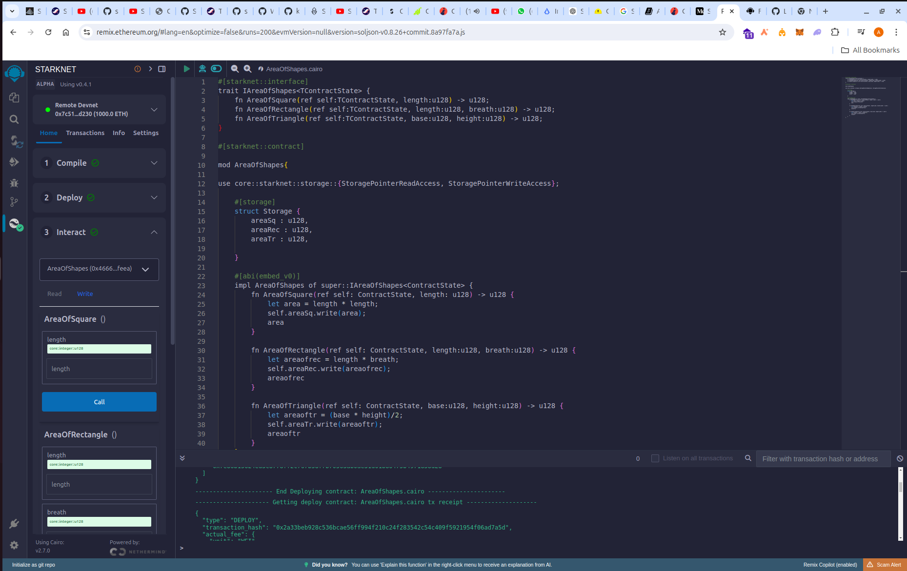

# AreaOfShapes Smart Contract

## Overview

The `AreaOfShapes` smart contract is a simple Cairo-based contract designed to calculate the area of various geometric shapes, including squares, rectangles, and triangles. The contract stores the calculated area in its storage and returns the value for each calculation.

## Features

- **Calculate Area of a Square:** Given the length of a side, the contract calculates and stores the area of a square.
- **Calculate Area of a Rectangle:** Given the length and breadth, the contract calculates and stores the area of a rectangle.
- **Calculate Area of a Triangle:** Given the base and height, the contract calculates and stores the area of a triangle.

## Contract Structure

The contract implements the following interface:

```rust
#[starknet::interface]
trait IAreaOfShapes<TContractState> {
    fn area_of_square(ref self: TContractState, length: u128) -> u128;
    fn area_of_rectangle(ref self: TContractState, length: u128, breadth: u128) -> u128;
    fn area_of_triangle(ref self: TContractState, base: u128, height: u128) -> u128;
}
```

## Deployment

### Prerequisites

- **Remix IDE:** A web-based development environment for smart contracts.
- **Cairo Plugin for Remix:** Ensure that your Remix IDE is set up to support Cairo smart contracts.

### Steps to Deploy

1. **Open Remix IDE:**
   - Visit [Remix IDE](https://remix.ethereum.org) in your browser.

2. **Set Up the Contract:**
   - Create a new file named `AreaOfShapes.cairo` in Remix.
   - Copy and paste the entire `AreaOfShapes` contract code into this file.

3. **Compile the Contract:**
   - Ensure the correct compiler version for Cairo is selected.
   - Click on the "Compile" button to compile the contract. Ensure there are no compilation errors.

4. **Deploy the Contract:**
   - Navigate to the "Deploy & Run Transactions" tab.
   - Select `AreaOfShapes` from the contract dropdown list.
   - Click on "Deploy" to deploy the contract to your chosen network.

5. **Interacting with the Contract:**
   - After deployment, use the interface in Remix to interact with the contract.
   - You can call `AreaOfSquare()`, `AreaOfRectangle()`, and `AreaOfTriangle()` functions by providing the necessary inputs.

### Deployment Screenshot

Here is a screenshot of the `AreaOfShapes` contract being deployed on Remix:


